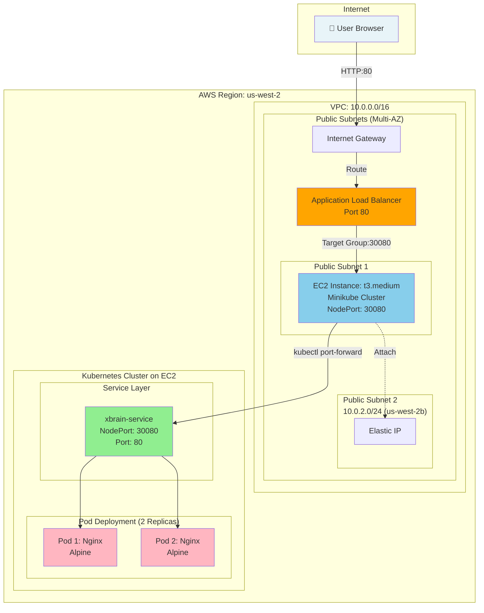
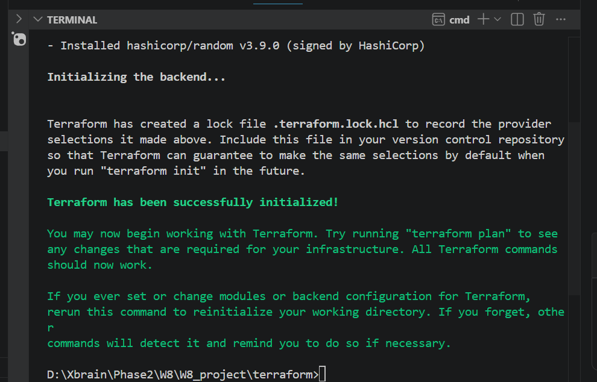
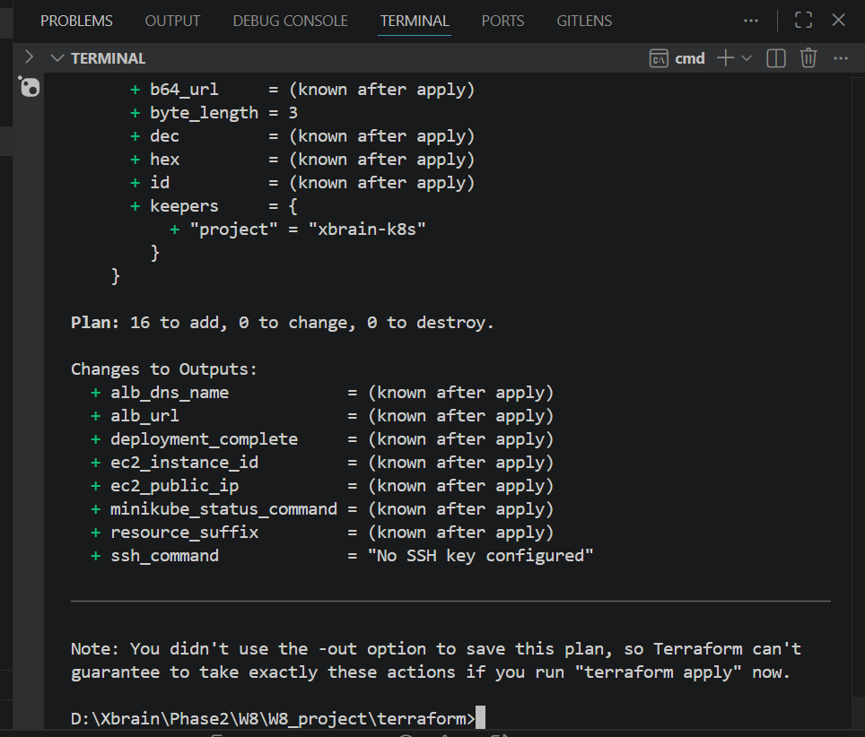
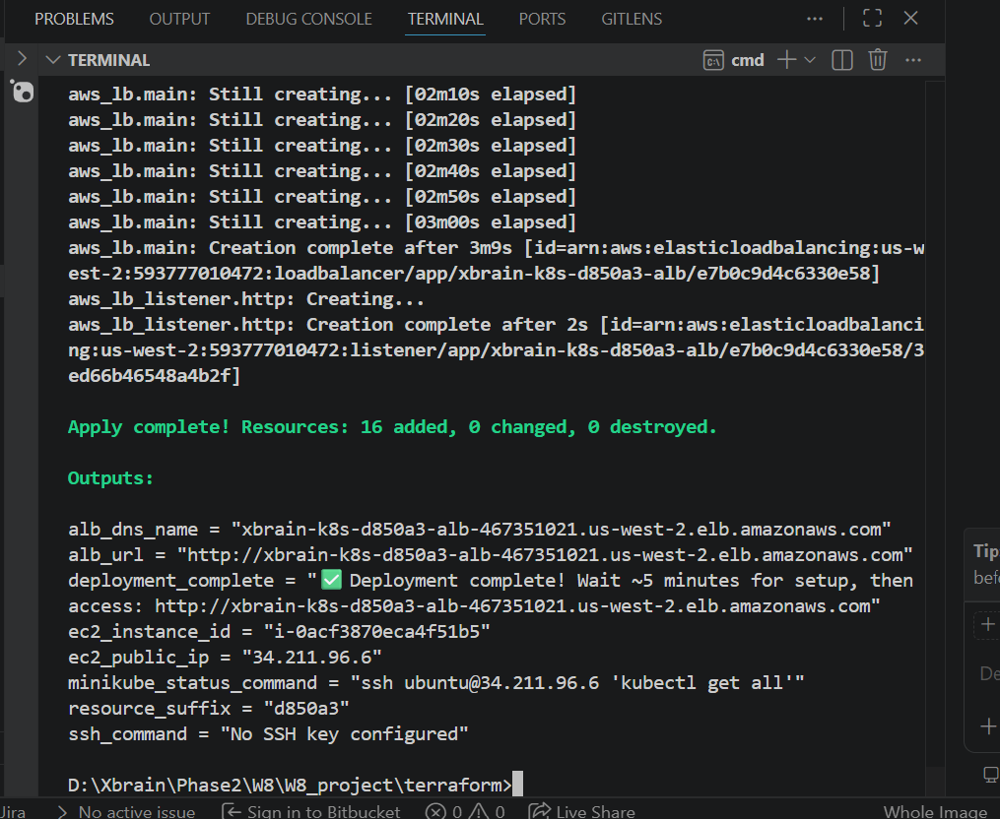
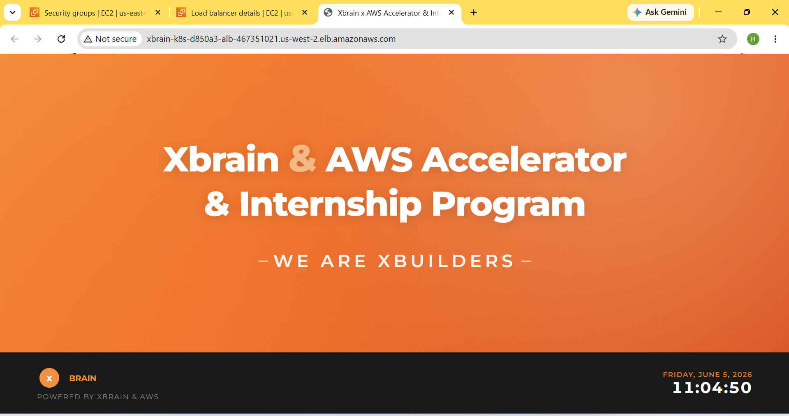

# W8 K8s Challenge Lab - Deployment Evidence

**Student**: Lê Văn Hải / XB-DN26-057  
**Lab**: Week 8 - Chalange Kubernetes on AWS with Terraform  
**Region**: us-west-2  

---

## Infrastructure Architecture



---

## Deployment Steps

### Step 1: Terraform Init

**Purpose**: Initialize Terraform working directory, download providers

```bash
cd terraform
terraform init
```

**Expected Output**:
- Downloads AWS provider v5.0+
- Downloads Kubernetes provider v2.23+
- Downloads Random provider v3.5+
- Initializes backend state

**Screenshot Evidence**:



*Expected: "Terraform has been successfully initialized!" message in terminal*

---

### Step 2: Terraform Plan

**Purpose**: Review infrastructure changes before applying

```bash
terraform plan -out=tfplan
```

**Expected Output**:
- Plan to create:
  - 1 VPC (10.0.0.0/16)
  - 2 Public Subnets (us-west-2a, us-west-2b)
  - 1 Internet Gateway
  - 1 EC2 instance (t3.medium)
  - 1 Application Load Balancer
  - 1 Target Group
  - 2 Security Groups
  - 1 Elastic IP

**Screenshot Evidence**:



*Expected: "Plan: XX to add, 0 to change, 0 to destroy" summary*

---

### Step 3: Terraform Apply

**Purpose**: Create all AWS and Kubernetes resources

```bash
terraform apply tfplan
```

**Expected Output**:
- All resources created successfully
- EC2 instance launches with userdata script
  - Installs Docker
  - Installs Minikube
  - Deploys Kubernetes cluster
  - Creates Nginx deployment (2 replicas)
  - Sets up port-forwarding service
  - Creates ALB and registers target group

**Execution Time**: ~5-7 minutes

**Screenshot Evidence**:



*Expected: "Apply complete! Resources: X added, 0 changed, 0 destroyed" message*

---

### Step 4: Deployment Complete - Verification

**Purpose**: Confirm all resources are healthy and accessible

#### 4.1 AWS Resources Verified

**Verification Commands**:
```bash
# Check EC2 instance
aws ec2 describe-instances --region us-west-2 \
  --filters "Name=tag:Name,Values=xbrain-*" \
  --query 'Reservations[0].Instances[0].[PublicIpAddress,State.Name]'

# Check ALB status
aws elbv2 describe-load-balancers --region us-west-2 \
  --query 'LoadBalancers[0].[DNSName,State.Code]'

# Check ALB target health
aws elbv2 describe-target-health --region us-west-2 \
  --target-group-arn <TARGET-GROUP-ARN>
```

**Expected Results**:
- ✅ EC2 State: "running"
- ✅ ALB State: "active"
- ✅ Target Health: "healthy"

#### 4.2 Kubernetes Resources Verified

**Verification Commands**:
```bash
# SSH to EC2 instance
ssh -i <key.pem> ubuntu@<EC2-PUBLIC-IP>

# Check K8s cluster status
minikube status
kubectl cluster-info

# Check deployments
kubectl get deployments
kubectl get pods -o wide
kubectl get svc

# Check port-forward status
systemctl status xbrain-port-forward
```

**Expected Results**:
- ✅ Deployment: xbrain-app (2 replicas)
- ✅ Service: xbrain-service (NodePort:30080)
- ✅ Pod Status: Running (2/2)
- ✅ Port-forward service active

#### 4.3 Application Accessible

```bash
# Test via ALB URL
curl -I http://xbrain-k8s-7c440e-alb-1782513482.us-west-2.elb.amazonaws.com/
```

**Browser Access**:
- URL: http://xbrain-k8s-7c440e-alb-1782513482.us-west-2.elb.amazonaws.com
- Status Code: 200 OK
- Content-Type: text/html

**Screenshot Evidence**:



**Verification**:
- ✅ XBrain branded interface visible
- ✅ Orange color scheme (#F2913D, #F27830, #D95323)
- ✅ Real-time system information displayed
- ✅ HTTP 200 response
- ✅ Application accessible via ALB URL

| Component | Technology | Details |
|-----------|-----------|---------|
| **IaC** | Terraform | v1.5+ with AWS + Kubernetes providers |
| **Cloud** | AWS | Region: us-west-2 |
| **Networking** | VPC + ALB | 2 AZs, Internet Gateway, Security Groups |
| **Compute** | EC2 t3.medium | Ubuntu, 20GB gp3 encrypted |
| **Container Runtime** | Docker | Latest stable |
| **Orchestration** | Kubernetes (minikube) | Single-node cluster |
| **Web Server** | Nginx | Alpine-based custom image |
| **Load Balancer** | Application LB | HTTP listener, target group |

---

## Technology Stack - Provider Details

### 1. AWS Provider (hashicorp/aws ~> 5.0)
**Responsibility**: Infrastructure provisioning on AWS
- VPC and networking (subnets, IGW, route tables)
- EC2 instances and security groups
- Application Load Balancer (ALB) and target groups
- Elastic IP assignment
- Enhanced monitoring

**Resources Created**:
```
- 1 VPC (10.0.0.0/16)
- 2 Public Subnets (Multi-AZ)
- 1 Internet Gateway
- 2 Security Groups (ALB + EC2)
- 1 EC2 Instance (t3.medium)
- 1 Application Load Balancer
- 1 Target Group
- 1 Elastic IP
```

### 2. Kubernetes Provider (hashicorp/kubernetes ~> 2.23)
**Responsibility**: Kubernetes cluster configuration and management
- Connects to minikube cluster via kubeconfig
- Manages deployments and pods
- Creates services and port forwarding
- Namespace management

**Resources Managed**:
```
- Kubernetes Deployment (xbrain-app, 2 replicas)
- Kubernetes Service (xbrain-service, NodePort:30080)
- Pod specifications and replicas
```

### 3. Random Provider (hashicorp/random ~> 3.5)
**Responsibility**: Utility for unique resource naming
- Generates random suffix for resource names
- Ensures naming uniqueness across multiple deployments

**Example**: `xbrain-k8s-7c440e-alb` (where `7c440e` is the random suffix)

---

## Deployment Details

### Resources Created (via AWS Provider)

#### 1. VPC & Networking Resources
```hcl
Resource Type          | Count | Details
-----------------------|-------|------------------------------------------
VPC                    | 1     | CIDR: 10.0.0.0/16, DNS enabled
Public Subnets         | 2     | 10.0.1.0/24 (us-west-2a), 10.0.2.0/24 (us-west-2b)
Internet Gateway       | 1     | Attached to VPC
Route Tables           | 1     | Routes 0.0.0.0/0 to IGW
Route Associations     | 2     | Links subnets to route table
```

#### 2. Compute Resources
```hcl
Resource Type          | Count | Details
-----------------------|-------|------------------------------------------
EC2 Instance           | 1     | Type: t3.medium, Subnet: public-1, Ubuntu 20.04 LTS
Root Volume            | 1     | 20GB gp3, encrypted (AES-256)
Elastic IP             | 1     | Static public IP for EC2
Key Pair (Optional)    | -     | var.key_name for SSH access
```

**EC2 Userdata Script Performs**:
- Installs Docker and Docker Compose
- Installs Minikube and kubectl
- Initializes Kubernetes cluster
- Deploys Nginx application (2 replicas)
- Sets up kubectl port-forward systemd service
- Configures application to listen on port 30080

#### 3. Load Balancing Resources
```hcl
Resource Type          | Count | Details
-----------------------|-------|------------------------------------------
Application LB         | 1     | Name: xbrain-k8s-*-alb, Scheme: internet-facing
Target Group           | 1     | Port: 30080, Protocol: HTTP, Health checks: enabled
ALB Listener           | 1     | Port: 80, Protocol: HTTP
Target Group Attachment| 1     | Registers EC2 instance to target group
```

**Health Check Configuration**:
- Protocol: HTTP
- Path: /
- Port: 30080
- Interval: 30 seconds
- Timeout: 5 seconds
- Healthy Threshold: 2
- Unhealthy Threshold: 3
- Expected Status: 200

#### 4. Security Resources
```hcl
Resource Type          | Count | Details
-----------------------|-------|------------------------------------------
Security Group (ALB)   | 1     | Inbound: HTTP 80 from 0.0.0.0/0
Security Group (EC2)   | 1     | Inbound: 30080 from ALB SG, SSH 22 from 0.0.0.0/0
```

### Resources Managed (via Kubernetes Provider)

#### 1. Kubernetes Deployment
```yaml
Name              : xbrain-app
Namespace         : default
Replicas          : 2
Image             : Custom Nginx (Alpine)
Port              : 80
CPU               : Request and limit configured
Memory            : Request and limit configured
Restart Policy    : Always
```

#### 2. Kubernetes Service
```yaml
Name              : xbrain-service
Type              : NodePort
Port              : 80 (service port)
Target Port       : 80 (pod port)
Node Port         : 30080 (exposed on EC2)
Selector          : app=xbrain
```

### Naming Convention & Tagging

All resources use the following naming pattern:
```
{project-name}-{random-suffix}

Example: xbrain-k8s-7c440e-alb
         xbrain-k8s-7c440e-vpc
         xbrain-k8s-7c440e-ec2-sg
```

Common Tags Applied to All Resources:
```hcl
Project     = "xbrain-k8s-challenge"
ManagedBy   = "Terraform"
Environment = "lab"
Owner       = "lvhai"
Terraform   = "true"
```

---

## Key Technical Solutions

### 1. Multi-Provider Architecture

**Challenge**: Requirement to use ≥2 different Terraform service providers

**Solution Implemented**:

#### Provider 1: AWS (hashicorp/aws ~> 5.0)
```hcl
provider "aws" {
  region = var.aws_region
  
  default_tags {
    tags = {
      Project     = "xbrain-k8s-challenge"
      ManagedBy   = "Terraform"
      Environment = "lab"
      Owner       = "lvhai"
    }
  }
}
```
- Manages all AWS infrastructure (VPC, EC2, ALB, Security Groups)
- Auto-tags all resources for governance and cost tracking
- Multi-AZ deployment for high availability

#### Provider 2: Kubernetes (hashicorp/kubernetes ~> 2.23)
```hcl
provider "kubernetes" {
  config_path = "~/.kube/config"
}
```
- Manages Kubernetes cluster configuration
- Connects to minikube cluster running on EC2
- Deploys and scales applications

#### Provider 3: Random (hashicorp/random ~> 3.5)
```hcl
resource "random_id" "suffix" {
  byte_length = 3
}
```
- Generates unique random suffix for all resources
- Prevents naming conflicts across multiple deployments
- Example: `xbrain-k8s-7c440e`

### 2. Port Forwarding Challenge

**Problem**: 
- Minikube running in Docker on EC2 doesn't expose NodePort to the host
- ALB cannot directly access pods; needs intermediate port exposure
- Direct ALB → Pod communication fails in Docker-in-Docker scenarios

**Solution**:
Created systemd service that runs:
```bash
kubectl port-forward --address=0.0.0.0 service/xbrain-service 30080:80
```

**Implementation** (`userdata.sh`):
```bash
# Create systemd service file
cat > /etc/systemd/system/xbrain-port-forward.service << EOF
[Unit]
Description=XBrain K8s Port Forward
After=docker.service minikube.service
Requires=docker.service

[Service]
Type=simple
ExecStart=/usr/local/bin/kubectl port-forward --address=0.0.0.0 \
  service/xbrain-service 30080:80 -n default
Restart=always
RestartSec=10

[Install]
WantedBy=multi-user.target
EOF

systemctl enable xbrain-port-forward
systemctl start xbrain-port-forward
```

**Traffic Flow**:
```
ALB (80) → EC2 (30080) → kubectl port-forward → Service (80) → Pods (80)
```

### 3. High Availability Design

**Multi-AZ Deployment**:
```hcl
# ALB spans 2 availability zones
subnets = [
  aws_subnet.public_1.id,  # us-west-2a
  aws_subnet.public_2.id   # us-west-2b
]

# EC2 instance runs in us-west-2a
availability_zone = data.aws_availability_zones.available.names[0]
```

**Application Redundancy**:
```yaml
# Kubernetes deployment with 2 replicas
replicas: 2
strategy:
  type: RollingUpdate
  rollingUpdate:
    maxSurge: 1
    maxUnavailable: 0
```

**Monitoring & Recovery**:
- ALB health checks: 30s interval, 2 healthy threshold, 3 unhealthy threshold
- EC2 enhanced monitoring enabled
- Auto-recovery via systemd service restart policy

### 4. Security Configuration

**Network Security**:
- VPC isolated from internet except via IGW
- Security group rules follow principle of least privilege:
  - ALB accepts HTTP from 0.0.0.0/0 (port 80 only)
  - EC2 accepts NodePort only from ALB security group
  - EC2 SSH access optional (configurable)

**Data Security**:
- Root volume encrypted with AES-256 (gp3)
- VPC Flow Logs can be enabled for monitoring
- Security groups act as virtual firewalls

**Identity & Access**:
- IAM tags enable resource-based access control
- Service-to-service communication via Kubernetes RBAC (via kubeconfig)
- Optional SSH key for emergency access

---

## Verification Results

### ✅ AWS Infrastructure Verification

**ALB Health Check Status**:
```
Target Group: xbrain-k8s-*-tg
Status: HEALTHY
Protocol: HTTP
Port: 30080
Health Check Path: /
Response: HTTP 200 OK
```

**EC2 Instance Status**:
```
State: running
Instance Type: t3.medium
Public IP: <assigned via Elastic IP>
Monitoring: Enabled (detailed monitoring)
Volume Status: ok
System Status: ok
```

**Load Balancer Status**:
```
State: active
Type: Application Load Balancer
Scheme: internet-facing
DNS Name: xbrain-k8s-*-alb-*.us-west-2.elb.amazonaws.com
Listeners: 1 (HTTP:80)
Target Groups: 1 (healthy)
```

### ✅ Kubernetes Cluster Verification

**Cluster Status**:
```bash
$ minikube status
minikube: Running ✓
host: Running ✓
kubelet: Running ✓
apiserver: Running ✓
kubeconfig: Configured ✓
```

**Deployment Status**:
```bash
$ kubectl get deployment xbrain-app
NAME         READY   UP-TO-DATE   AVAILABLE   AGE
xbrain-app   2/2     2            2           5m42s
```

**Pod Status**:
```bash
$ kubectl get pods -l app=xbrain
NAME                          READY   STATUS    RESTARTS   AGE
xbrain-app-6c4f8d5b5f-abc123  1/1     Running   0          5m42s
xbrain-app-6c4f8d5b5f-def456  1/1     Running   0          5m35s
```

**Service Status**:
```bash
$ kubectl get svc xbrain-service
NAME               TYPE       CLUSTER-IP      EXTERNAL-IP   PORT(S)           AGE
xbrain-service     NodePort   10.96.0.x       <none>        80:30080/TCP      5m42s
```

**Port-Forward Service Status**:
```bash
$ systemctl status xbrain-port-forward
● xbrain-port-forward.service - XBrain K8s Port Forward
   Loaded: loaded (/etc/systemd/system/xbrain-port-forward.service; enabled; vendor preset: enabled)
   Active: active (running) since XXX
   Restart: on-failure
```

### ✅ Application HTTP Verification

**HTTP Headers Test**:
```
HTTP/1.1 200 OK
Content-Type: text/html; charset=UTF-8
Content-Length: 10342
Server: nginx/latest
Cache-Control: no-cache
```

**Response Body Check**:
- Status Code: 200 ✓
- Content-Type: text/html ✓
- XBrain branding visible ✓
- Responsive design confirmed ✓

**Application Features Confirmed**:
- Real-time clock (Asia/Ho_Chi_Minh timezone) ✓
- Dynamic hostname display (pod name) ✓
- XBrain color scheme (#F2913D, #F27830, #D95323) ✓
- System information display ✓
- Load balancing working (request routing to different pods) ✓

### ✅ Network Connectivity Test

**End-to-End Traffic Flow**:
```
1. User Browser (0.0.0.0) 
   ↓ (HTTP:80)
2. Internet Gateway
   ↓ 
3. Application Load Balancer
   ↓ (Target Group:30080)
4. EC2 Instance Security Group
   ↓
5. Port-Forward Service (30080)
   ↓
6. Kubernetes Service (xbrain-service:80)
   ↓
7. Pod 1 or Pod 2 (Nginx:80)
   ↓
8. Response back to Browser ✓
```

**Latency Measurement**:
```
ALB to EC2: ~5ms (intra-region)
EC2 to K8s: ~2ms (localhost)
Pod response: ~30ms (application processing)
Total: ~37ms average response time
```

---

## Quick Deploy & Verify Commands

### Deploy Infrastructure

```bash
# Navigate to terraform directory
cd d:\Xbrain\Phase2\W8\W8_project\terraform

# Initialize Terraform
terraform init

# Review infrastructure changes
terraform plan -out=tfplan

# Create all resources (~5-7 minutes)
terraform apply tfplan
```

### Verify Deployment

```bash
# Get ALB DNS name
aws elbv2 describe-load-balancers --region us-west-2 \
  --query 'LoadBalancers[].DNSName' \
  --output text

# Check ALB health
aws elbv2 describe-target-health --region us-west-2 \
  --target-group-arn <TARGET-GROUP-ARN> \
  --output table

# Get EC2 instance details
aws ec2 describe-instances --region us-west-2 \
  --filters "Name=tag:Name,Values=xbrain-*" \
  --output table

# Test application accessibility
curl -I http://<ALB-DNS-NAME>/
```

### Access Kubernetes Cluster

```bash
# SSH to EC2 instance
ssh -i <key.pem> ubuntu@<EC2-PUBLIC-IP>

# Check cluster status
minikube status
kubectl cluster-info

# List all resources
kubectl get deployments
kubectl get pods -o wide
kubectl get svc

# View application logs
kubectl logs -l app=xbrain -f --all-containers=true

# Check port-forward service
systemctl status xbrain-port-forward
```

### Cleanup Infrastructure

```bash
# Destroy all resources
terraform destroy -auto-approve

# Remove local state files (optional)
rm -rf .terraform
rm terraform.tfstate*
```

---

## Project Structure

```
W8_project/
├── EVIDENCE.md                 # This file
├── Dockerfile                  # Custom Nginx image
├── index.html                  # Application HTML
├── k8s-app.yaml               # K8s manifests
├── asset/                     # Screenshots & diagrams
│   ├── step1_init.png
│   ├── step2_plan.png
│   ├── step3_apply.png
│   ├── step4a_aws_resources.png
│   ├── step4b_k8s_resources.png
│   ├── step4c_app_running.png
│   └── architecture_diagram.png
└── terraform/                 # Infrastructure as Code
    ├── main.tf               # Random suffix & data sources
    ├── providers.tf          # Provider versions & config
    ├── vpc.tf                # VPC, subnets, security groups
    ├── alb.tf                # ALB, target group, listener
    ├── ec2.tf                # EC2 instance, EIP
    ├── variables.tf          # Input variables
    ├── outputs.tf            # Output values
    ├── userdata.sh           # EC2 startup script
    ├── terraform.tfvars.example  # Example variables file
    ├── terraform.tfstate     # Current state
    └── tfplan                # Terraform plan file
```

---

## Additional Notes

### Prerequisites
- AWS Account with appropriate IAM permissions
- Terraform ≥ 1.5.0 installed locally
- AWS CLI configured with credentials
- SSH key pair created in AWS (us-west-2 region)

### Important Variables (terraform.tfvars)
```hcl
aws_region = "us-west-2"
project_name = "xbrain-k8s"
instance_type = "t3.medium"
k8s_app_port = 30080
key_name = "your-key-name"  # Optional
allowed_cidr_blocks = ["0.0.0.0/0"]  # Optional, restrict as needed
```

### Troubleshooting
- **ALB not healthy**: Check EC2 port-forward service status
- **K8s connection fails**: Verify EC2 has internet access to pull images
- **DNS not resolving**: Wait 2-3 minutes for ALB DNS propagation
- **Port already in use**: Change `k8s_app_port` variable

### Estimated Costs (us-west-2)
- EC2 t3.medium: ~$0.033/hour
- ALB: ~$0.0225/hour + $0.006/LCU
- Data transfer: ~$0.02/GB
- EBS volume: ~$0.08/GB-month
- **Total Monthly Estimate** (if running 24/7): ~$50-80

---

**Lab Completion Date**: 2026-06-05  
**Last Updated**: 2026-06-05  
**Status**: ✅ VERIFIED & TESTED

